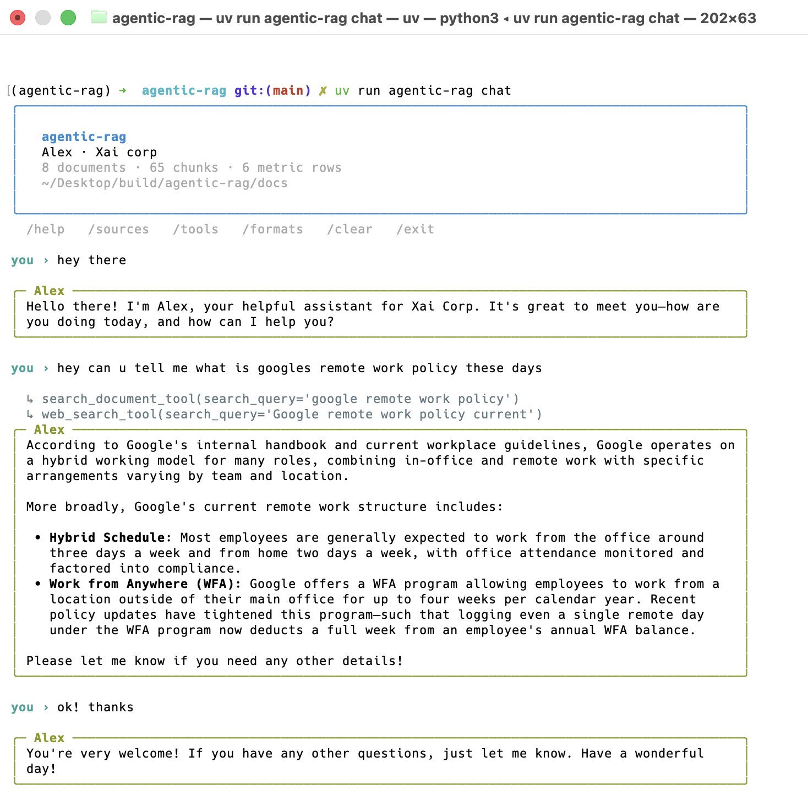

# agentic-rag

Chat with your data.

An agentic chat tool that runs in your terminal. It has tools it can reason
with, so it will search your documents, run SQL over your numbers, read a file,
check the web or do the math, whatever the question needs, and answer from what
it finds instead of guessing.

Point it at a folder of your own documents and start asking questions.



It combines tools when a question needs it. Here it pulls the numbers with SQL,
then does the arithmetic with the calculator:

```
you › how much did Google Cloud revenue grow between Q1 and Q3 2025?

  ↳ query_metrics_tool(search_query='Google Cloud revenue Q1 and Q3 fiscal 2025')
  ↳ calculator_tool(expression='(15157 - 12260) / 12260 * 100')

╭─ Sam ─────────────────────────────────────────────────────────────────────╮
│ Google Cloud revenue grew from $12,260M in Q1 2025 to $15,157M in Q3 2025, │
│ an increase of about 23.6%.                                               │
╰───────────────────────────────────────────────────────────────────────────╯
```

## Features

- **Five tools** the model can call and combine: document search, full document
  read, text-to-SQL over a metrics table, web search, and a calculator.
- **Bring your own documents.** Point it at any folder, in 14 file formats.
- **Grounded answers.** Factual questions are answered only from tool output,
  and the agent says so when the corpus does not have the answer.
- **A visible tool trace**, so you can see how an answer was reached.
- **Built-in evaluation** with a golden set, scored across three dimensions and
  tracked run over run.
- **Five colour themes**, and a layout that adapts to the terminal width.

## How it works

```
              ┌───────────────┐
   question → │  agent loop   │ ── model picks a tool ──┐
              │  (agent.py)   │ ←── tool result ────────┤
              └───────────────┘                         │
                      │                    ┌────────────┴─────────────┐
                   answer                  │ search_document_tool     │ LanceDB vector search
                                           │ read_document_tool       │ a full file from the corpus
                                           │ query_metrics_tool       │ text-to-SQL over SQLite
                                           │ web_search_tool          │ Tavily
                                           │ calculator_tool          │ sandboxed arithmetic
                                           └──────────────────────────┘
```

The system prompt grounds the agent. Factual questions must be answered from
tool output only, and it is told to say "I don't have that information" rather
than fall back on the model's own knowledge.

**Retrieval.** Documents are split into 1000-character chunks with 150
characters of overlap, embedded with `gemini-embedding-001` at 768 dimensions,
and stored in LanceDB. Queries are embedded with the `RETRIEVAL_QUERY` task
type, which pairs with the `RETRIEVAL_DOCUMENT` type used at index time.

**Metrics.** A `financials.csv` in the corpus is loaded into SQLite, with column
types inferred from its contents. The SQL tool reads the live table schema and
the distinct values of every low-cardinality column, so the model filters on
values that exist in the data. Generated SQL must be a single `SELECT` and runs
on a read-only connection.

## Technologies used

| Technology | Used for |
| --- | --- |
| [Gemini](https://ai.google.dev/) via `google-genai` | The chat model (`gemini-3.5-flash-lite`) and embeddings (`gemini-embedding-001`, 768 dimensions) |
| [LanceDB](https://lancedb.com/) | Vector store for the document chunks |
| SQLite | Holds the metrics table, queried read-only |
| [Tavily](https://tavily.com/) | Web search |
| [Rich](https://rich.readthedocs.io/) | The terminal interface |
| [simpleeval](https://github.com/danthedeckie/simpleeval) | Sandboxed arithmetic for the calculator |
| [Pydantic](https://docs.pydantic.dev/) | Validates the SQL the model generates |
| [pypdf](https://pypdf.readthedocs.io/) and [python-docx](https://python-docx.readthedocs.io/) | Optional PDF and DOCX readers |
| [uv](https://docs.astral.sh/uv/) | Dependencies, packaging and running |


No agent framework. Everything is built from scratch.

## Setup

Requires Python 3.12+ and [uv](https://docs.astral.sh/uv/).

```bash
uv sync
cp .env.example .env    # add your GEMINI_API_KEY (and TV_API_KEY for web search)
uv run agentic-rag ingest
uv run agentic-rag chat
```

`ingest` builds the knowledge stores into `data/`. It is safe to re-run, since
it rebuilds from scratch.

## Commands

```bash
uv run agentic-rag chat               # interactive session
uv run agentic-rag chat --hide-tools  # hide the tool-call trace
uv run agentic-rag ingest             # index the corpus
uv run agentic-rag sources            # what is currently indexed
uv run agentic-rag formats            # supported file formats
uv run agentic-rag themes             # preview the colour palettes
uv run agentic-rag eval               # run the golden-set evaluation
uv run agentic-rag -v chat            # debug logging (generated SQL, retrieval hits)
```

Inside a chat: `/help` `/sources` `/tools` `/formats` `/clear` `/exit`.

## Using your own documents

Point `--docs` at any folder. It is scanned recursively, and hidden files and
junk directories such as `.git`, `node_modules` and virtualenvs are skipped.

```bash
uv run agentic-rag --docs ~/work/handbook ingest
uv run agentic-rag --docs ~/work/handbook chat
```

To keep several corpora side by side, give each one its own index:

```bash
uv run agentic-rag --docs ~/work/handbook --data ~/.agentic-rag/handbook ingest
uv run agentic-rag --docs ~/work/handbook --data ~/.agentic-rag/handbook chat
```

Or set `DOCS_DIR` and `DATA_DIR` in `.env` and drop the flags.

To make numbers queryable by SQL, put a `financials.csv` with any columns you
like in the corpus folder. Without one, the SQL tool reports itself unavailable
and the other tools carry on as normal.

After indexing, run `agentic-rag sources` to check that every file you expected
is there, and whether anything was skipped.

### Supported formats

| | Formats | Requires |
| --- | --- | --- |
| Text | `.txt` `.md` `.markdown` `.rst` `.log` `.csv` `.tsv` `.yaml` `.yml` | built in |
| Structured | `.json` (pretty-printed), `.html` `.htm` (tags stripped) | built in |
| Binary | `.pdf`, `.docx` | `uv sync --extra docs` |

Anything else is ignored. If a PDF or DOCX turns up without the optional
packages installed, ingest skips that file and explains why instead of failing
the run.

Adding a format is one function in
[src/agentic_rag/loaders.py](src/agentic_rag/loaders.py):

```python
LOADERS[".epub"] = my_epub_reader   # Path -> str
```

## Evaluation

A golden set of 21 questions over the sample corpus, so you can tell whether a
change made things better or worse.

```bash
uv run agentic-rag eval                      # run them all
uv run agentic-rag eval --case refund-window # run one
uv run agentic-rag eval --history            # score trend over past runs
```

```
   case                          routing     retrieval     answer
 ──────────────────────────────────────────────────────────────────
   refund-window                 ✓           ✓             ✓
   nvidia-outlook                ✓           ✓             ✓
   refuse-parental-leave         ✓           –             ✓
   …
────────────────────────────────────────────────────────────────────
routing 21/21   retrieval 14/14   answer 21/21
21/21 cases passed (100%)   ▲ +2 vs previous run (90%)
fixed: nvidia-data-center, nvidia-outlook
```

Three dimensions are scored separately, so when a score drops you know which
part broke:

- **routing**: were the right tools called, and the wrong ones avoided? Using
  the web to answer an internal policy question fails even if the answer is
  correct.
- **retrieval**: did the expected document come back?
- **answer**: does the reply contain the expected facts, or decline when the
  corpus has no answer?

A `–` means the case makes no claim about that dimension, so it neither inflates
nor deflates the score.

Every full run is appended to `data/eval-history.jsonl`. Each run prints its
delta against the previous one, along with which cases regressed and which were
fixed. Runs filtered with `--case` are not recorded, since they are not
comparable to a full run. The command exits non-zero on any failure, so it works
as a CI gate.

Cases live in [evals/golden.toml](evals/golden.toml):

```toml
[[case]]
id = "refund-window"
question = "How many days do I have to return a Pixel phone?"
expect_tools = ["search_document_tool"]
forbid_tools = ["web_search_tool"]
expect_sources = ["refund_policy.md"]
expect_contains = ["15"]          # commas and case ignored, so "12260" matches "$12,260"

[[case]]
id = "refuse-parental-leave"
question = "How many weeks of paid parental leave does the company offer?"
must_refuse = true                # not in the corpus, so the agent must say so
```

The set includes refusal cases on purpose. An assistant that answers
confidently about something absent from the corpus is broken in a way that
happy-path testing does not reveal.

If you swap in your own corpus, rewrite the cases to match it.

## Configuration

| Variable | Required | Purpose |
| --- | --- | --- |
| `GEMINI_API_KEY` | yes | Chat and embedding models |
| `TV_API_KEY` | no | Enables `web_search_tool`. Without it the tool reports that it is unavailable |
| `DOCS_DIR` | no | Default corpus directory, overridden by `--docs` |
| `DATA_DIR` | no | Where the index lives, overridden by `--data` |
| `ASSISTANT_NAME` | no | Persona name, default `Sam` |
| `ORGANIZATION` | no | Company the agent answers for, default `Acme Corp` |
| `THEME` | no | Colour palette, default `nord` |

Model names and chunk sizes live in
[src/agentic_rag/config.py](src/agentic_rag/config.py). If answers seem to miss
context, `CHUNK_SIZE` and `CHUNK_OVERLAP` are the first things to adjust, then
re-run `ingest`.

### Themes

Five palettes ship with it: `nord` (default), `catppuccin`, `gruvbox`,
`solarized` and `dracula`.

```bash
uv run agentic-rag themes                  # preview them all
uv run agentic-rag --theme gruvbox chat    # use one now
```

Set `THEME=gruvbox` in `.env` to make it stick. To add your own, append a
six-colour `Palette` to `PALETTES` in
[src/agentic_rag/theme.py](src/agentic_rag/theme.py). The interface refers to
colours by role (`accent`, `agent`, `tool`, `warn`, `error`), so nothing else
needs to change.

The layout also adapts to the terminal. Prose is capped at 96 columns so answers
stay readable in a wide window, and below 72 columns the banner, progress bar
and command hints switch to compact forms.

## Adding a tool

Each tool is one module in [src/agentic_rag/tools/](src/agentic_rag/tools/) that
exposes a single `TOOL` object:

```python
from agentic_rag.tools.base import Tool, ToolContext, string_params

def my_tool(ctx: ToolContext, some_arg: str) -> str:
    return f"result for {some_arg}"

TOOL = Tool(
    name="my_tool",
    description="What this does, written for the model to read.",
    parameters=string_params(some_arg="What to pass here."),
    handler=my_tool,
)
```

Then add the module to `_MODULES` in
[src/agentic_rag/tools/__init__.py](src/agentic_rag/tools/__init__.py). The
`ToolContext` carries the Gemini client, resolved settings and the open vector
table, so tools do not need module-level globals. The agent loop catches tool
errors and hands them back to the model as text, so a failing tool degrades the
answer instead of ending the session.

## Layout

```
src/agentic_rag/
├── agent.py       # conversation + tool-calling loop
├── cli.py         # chat / ingest / sources / formats / eval
├── config.py      # paths, model names, env-backed settings
├── evals.py       # golden-set scoring and run history
├── ingest.py      # corpus → vector index + metrics database + manifest
├── loaders.py     # file format registry
├── retrieval.py   # embeddings and vector search
├── theme.py       # colour palettes and layout helpers
└── tools/         # one module per capability
evals/golden.toml  # the golden set (checked in)
docs/              # sample corpus (checked in)
data/              # generated index and eval history (gitignored)
```

The sample corpus is a fictional company handbook, refund policy, product
overview and investor FAQ, plus public Alphabet and NVIDIA 10-Q excerpts.

## License

MIT
